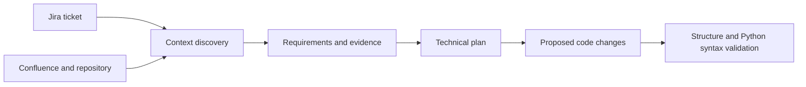

# Interlock

A development assistant that combines Jira tickets, Confluence documentation, and repository context to produce structured requirements, technical plans, and proposed code changes.

## Highlights

- Atlassian integration through MCP.
- Repository checkout and code indexing for contextual retrieval.
- Explicit context, requirements, plan, and code-change artifacts.
- Validation gates between pipeline phases.
- JSON-shape checks and Python syntax checks for generated changes.
- Streamlit interface showing requirements, plans, and proposed code.

## Workflow



The orchestrator is `core/synchronizer.py`. Phase services coordinate synthesizers, typed artifacts, and gates. The final phase returns generated changes for inspection; it does not demonstrate that they pass application tests.

## Setup

Requires Python 3.12, `uv`/`uvx` for the Atlassian MCP subprocess, Git, a Groq key, and access to your Jira/Confluence demo workspace.

```sh
python3.12 -m venv .venv
source .venv/bin/activate
python -m pip install -r requirements.txt
cp .env.example .env
# Configure your own accounts and a demo repository in .env.
python -m streamlit run app.py
```

Enter a Jira ticket ID in the sidebar and start a sync cycle. Some context prompts currently appear in the launching terminal. The orchestrator checks out and indexes the configured repository under `.data/`; use a dedicated demo repository.

The current Confluence-space defaults are `ENG`, `ARCH`, and `INT`; adjust `allowed_confluence_spaces` in `core/synchronizer.py` for your workspace. Local embedding models may download on first use.

## Project map

- `app.py`: Streamlit interface.
- `core/phases/`: infrastructure, discovery, requirements, planning, and generation.
- `core/models/`: structured artifacts exchanged by phases.
- `core/gates/`: validation before progressing.
- `core/synthesizers/`: model-backed transformations.
- `core/sources/`: source adapters.
- `core/utils/`: Git and knowledge-base helpers.

## Scope and next steps

This is a prototype for assisted development. Syntax validation does not prove correctness. The pipeline generates proposed changes; it does not automatically merge or deploy them. A repeatable fixture-based demonstration and an automated regression suite are future work. Dependency versions are not fully locked.

## Author

Aviel Adika. Personal software project.
